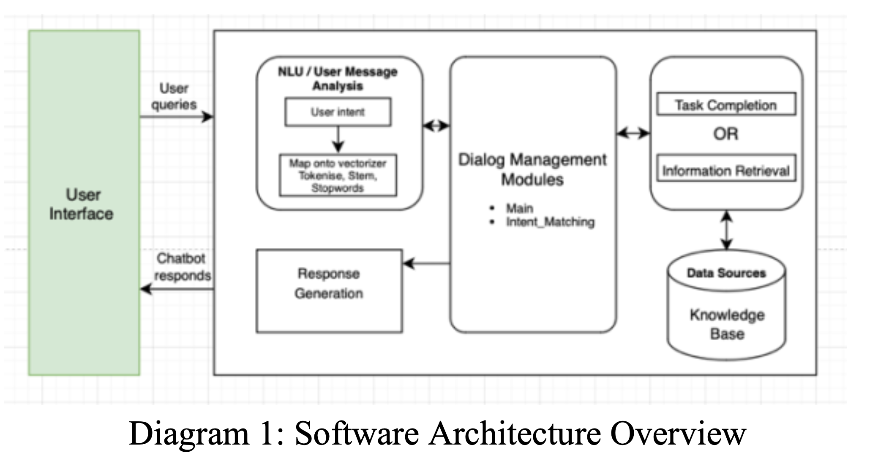
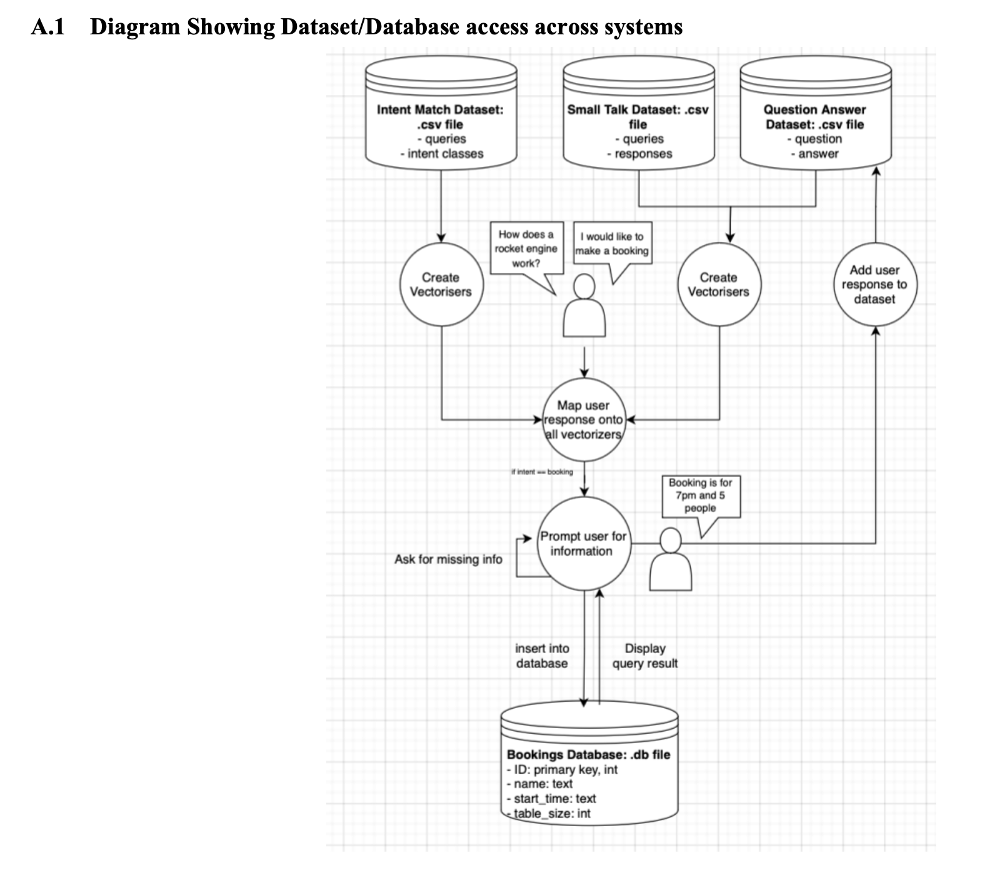
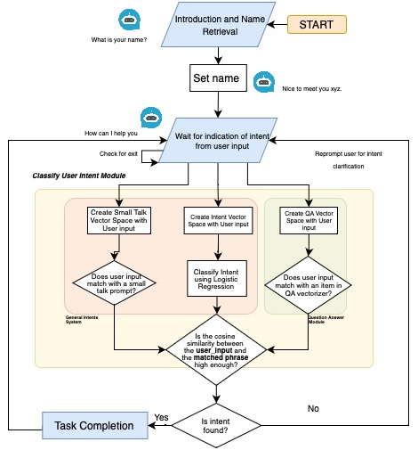
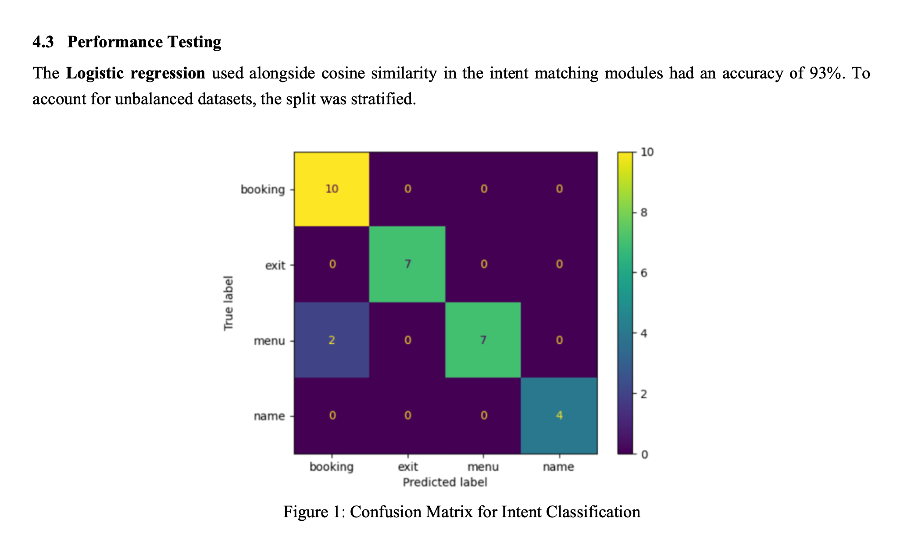

# Natural Language Processing: Chatbot
## Pizzeria Restaurant Booking 

Round-the-clock top quality customer service has become the standard to maintaining brand loyalty – particularly in the hospitality industry. Conversational agents, colloquially known as Chatbots, use natural language understanding to respond to a customer and
provide them with what they need. A well-designed Chatbot can simulate top-tier customer service 24/7, while roleplaying
as a friend, a search engine, or a receptionist all in one, freeing up time, costs, and mental load for employees. Papa's pizzeria can do all of these things, adapting smoothly and fluently to different circumstances and inputs. Very bare bones early Natural Language processing, that follows a template-based approach.

## Installation

Basic NLP libraries used, limited to NLTK and SciKitLearn for Feature Extraction.
Database management used SQLite3.
JobLib for loading models in and out. 

1. Clone the repository
2. Recommended: install the required packages on a virtual environment
- Example bash script, for MacOS/Linux:
```bash
python3 -m venv venv
source venv/bin/activate
pip install -r requirements.txt
```
3. Run the main.py file to start the chatbot

## Examples of Usage

````
Hi, I'm Papa the Chatbot for Papa's Pizzeria! And what is your name?Constance
Papa: Hello Constance, it is nice to meet you! How can I help you today?
Constance: My name is Constance, nice to meet you too
Papa:  The pleasure is all mine.
Constance: What can you do ?
Papa: I can talk to you about anything! More specifically, I can... - Make table bookings/reservations for you, with the time and table size. - Show you the Menu, or query a certain dish - Answer general knowledge questions and more 
Constance: I'm not sure which one, can we just talk?
Papa: Sure! What would you like to know?
Constance: When did Anne Frank die?
Papa: Anne Frank died in March 1945, in the Bergen-Belsen concentration camp.
Constance: Can you tell me about the menu?
Papa: So you are interested in the menu!
Dish                      Description                                                            Price     
---------------------------------------------------------------------------------------------------------
Margherita Pizza          Classic pizza with tomato, fresh mozzarella, and basil.                $10.99    
Spaghetti Bolognese       Spaghetti pasta with a rich meat sauce.                                $12.99    
Caprese Salad             Fresh tomatoes, mozzarella, and basil drizzled with balsamic glaze.    $8.99     
Chicken Parmesan          Breaded and fried chicken topped with marinara sauce and melted cheese. $14.99    
Ravioli al Pomodoro       Homemade ravioli stuffed with ricotta cheese, served with tomato sauce. $11.99    
Tiramisu                  Traditional Italian dessert made with layers of coffee-soaked ladyfingers and mascarpone cheese. $6.99     
Espresso                  Strong and rich Italian coffee.                                        $3.99     
Gelato                    Assorted flavors of Italian ice cream.                                 $5.99   
Constance: I'm not reading that, do you have tiramisu on the menu?
Papa: Papa: So you are interested in the menu!
Alright! Here is a dish that might be what you're looking for:
Dish                      Description                                                            Price     
---------------------------------------------------------------------------------------------------------
Tiramisu                  Traditional Italian dessert made with layers of coffee-soaked ladyfingers and mascarpone cheese. $6.99

Constance: I would like to book a table
Papa: Great! When would you like to book a table for?
Constance: Tomorrow at 7pm
Papa: How many people will be in your party?
Constance: 10 people
Papa: Wow! Sounds like a party!
Papa: Your table has been booked for tomorrow at 7pm for 4 people. We look forward to seeing you!
Constance: Thank you. Go away. 
Thank you and Arrivederci!
````


## Methodology / Approach

- Concepts utilised: Word Embeddings/ Vectorizers, Cosine Similarity, Intent Matching and Bag-of-words model, Active Learning
- Chatbot Usability Heuristics: Learnability, Interpretability, Memorability, Error Handling, Satisfaction





## Evaluation & Testing 
- Chatbot Usability Questionairre: Achieved 70.3, A high benchmark for usability
            

## Future Plans
- I will continue by developing more intricate Chatbot systems, that include deep learning, Convolutional Neural Networks and pre-trained transformers that I will fine tune and build upon for my specific use case. 

## Acknowledgmenets

J. Nielsen, How many test users in a usability study? 2012. [Online]. Available: https://www.nngroup.com/articles/how-many-test-users/.

Holmes, S., & Bond, R. (2019). The Chatbot Usability Questionnaire (CUQ). Www.ulster.ac.uk.https://www.ulster.ac.uk/research/topic/computer-
science/artificial-intelligence/projects/cuq

NLTK 3.6.2 documentation. (2021). Nltk.org. https://www.nltk.org/
